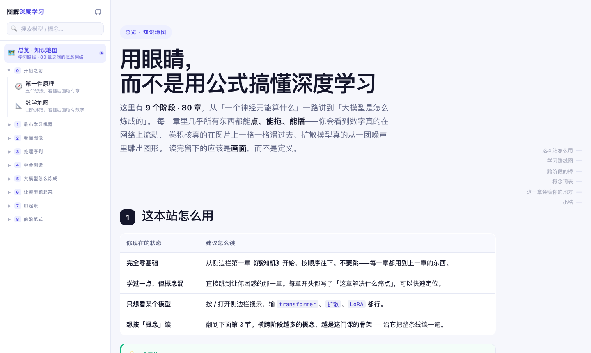
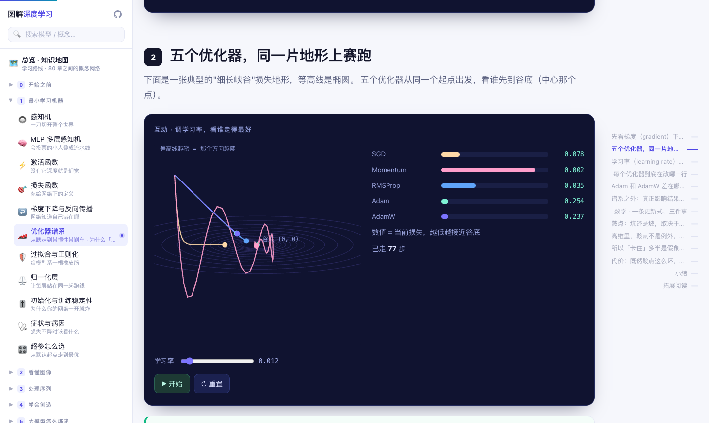

<div align="center">

# 图解深度学习

**用眼睛，而不是用公式搞懂深度学习**

从「一个神经元能算什么」到「大模型到底在想什么」

**9 个阶段 · 80 章 · 全部完成 · 完全免费**

## 👉 [**deeplearning.wizardwu.top**](https://deeplearning.wizardwu.top) 👈

[](https://deeplearning.wizardwu.top)
[](https://deeplearning.wizardwu.top)
[](https://deeplearning.wizardwu.top)
[](./LICENSE-CONTENT)

</div>

<div align="center">
  
  <br><br>
  
  <br>
  <em>↑ 五个优化器在同一片峡谷地形上赛跑。SGD 沿谷底来回横跳，AdamW 直奔谷底。</em>
</div>

---

## 为什么会有这个网站

网上的深度学习教程很多，但真正适合「完全不懂的人」的很少。常见的三种读不下去：

| 读不下去的原因 | 这个网站怎么解决 |
|---|---|
| **太碎** —— 学完 CNN 学 RNN，但不知道这两章之间有什么关系，也不知道为什么要发明它 | **能力递进**：每一章解决上一章留下的一个具体痛点，顺着读不会出现「这东西为什么存在」的困惑 |
| **太重** —— 第一页就要微积分，符号没解释，公式一行行推 | **大图少字**：先给图，再给话；每个符号第一次出现都有人话注解；第 1 节不需要任何前置知识 |
| **太静** —— 动画播完就没了，看完还是不会 | **直观可玩**：几乎所有演示都能拖、能点、能播，而且**背后是真的在算**，不是录好的动画 |

一句话概括它的性格：**它不是把教科书搬到网上，而是把「想不明白的地方」一张图一张图地拆开。**

---

## 一、系统性：一条线，从头走到尾

### 不是模型罗列，是能力递进

不按「CNN 一章、RNN 一章」这种按模型切的方式组织，而是按**能力**：

```
一个神经元能学什么  →  怎么让图片被看懂  →  怎么处理有顺序的东西  →  怎么创造
→  怎么把它做大做对  →  怎么让它跑得快  →  怎么用起来  →  前沿正在发生什么
```

每一章的开头都接着上一章结尾那个**没解决的问题**。比如：

- 上一章的死因是「每读一个词就把整个记忆重写一遍」→ 这一章讲门控怎么解决它
- 上一章把整句话压进一个固定大小的口袋 → 这一章讲注意力怎么把这个口袋拆掉
- 上一章证明了 3×3 的小印章能省参数 → 这一章问：那堆 20 层之后它还看得见什么

### 每一章都是同一个骨架

80 章用的是同一套结构，读到第 5 章你就知道该怎么读了：

| | 这一节回答什么 |
|---|---|
| **1 Hero** | 这一章解决什么痛点（一句话） |
| **2 痛点** | 上一章留下了什么没解决 |
| **3 机制** ★ | 核心原理 + 一个能动手的互动 |
| **4 谱系** ★ | 这个主题的**完整家族对照表**——所有主要变体都在一张表里 |
| **5 代价** | 牺牲了什么 / 什么时候不该用它 |
| **6 本质** ★ | 第一性原理，固定三行 |
| **7 暗线呼应** | 数据形状怎么变、参数账本、算力还是带宽受限、它假设了什么 |
| **8 TLDR** | 一句话带走，必须带「所以呢」 |

**「谱系」和「代价」两节是刻意的**：讲一个方法却不讲它的家族和它的债，读者就只会背结论。所以每一章都给完整谱系表，并且明说这个方法什么时候不该用。

### 章与章之间是连起来的

80 章不是 80 个孤岛。每一章末尾有一个**自动生成**的「这一章和什么有关」区块：前置知识、共享概念最多的章、以及按概念串起来的邻居。

数据层只有一件事：每个条目上挂 4 个概念标签（全站 45 个受控标签）。

```js
{ slug: 'cnn', ..., tags: ['卷积','视觉','表示','线性代数'], pre: ['mlp'] }
```

全图规模：**45 个概念标签 · 222 条边 · 27 个横跨 3 个以上阶段的桥 · 零孤立章**。
它找出来的关联，顺着读是发现不了的，例如：

```
Mamba（前沿范式）  →  Seq2Seq    「循环 · 注意力」
                 →  高效注意力  「注意力」
                 →  KV Cache    「注意力」

LoRA（大模型）     →  一致性模型  「压缩」
                 →  混合精度    「压缩 · 显存」
```

### 还有六条暗线

除了表面上的 80 章，全站还埋了**六条暗线**，每一章都必须回答：

**A 信息怎么流动**（数据形状是什么）· **B 什么被牺牲了**（代价是什么）· **C 参数账本**（真实参数量/算力/显存）· **D 跑在什么上**（算力受限还是带宽受限）· **E 它假设了什么**（归纳偏置）· **F 违背了哪个直觉**

---

## 二、简洁易懂：五条硬标准

每一章都必须过这五条，过不了就不算写完：

| # | 标准 | 意思 |
|---|---|---|
| 1 | **有一个可复述的类比** | 读完能用自己的话讲出「它像什么」 |
| 2 | **有一个可记住的画面** | 关掉页面，脑子里还剩一张图 |
| 3 | **没有一个悬空符号** | 每个数学符号第一次出现就带人话注解 |
| 4 | **第 1 节不需要前置知识** | 不出现未解释的术语 |
| 5 | **能亲手验证一个结论** | 至少有一处「你拖到最右边试试」 |

**反面清单**（出现即不合格）：连续两段超过 4 行的纯文字而没有图 · 出现「众所周知」「显然」「简单推导可得」 · 公式超过一行却不拆解 · 互动只是循环动画、不能操作。

还有一个密度下限：**每 300~400 字至少一个可视元素**。

> 目标读者是**完全零基础的人**。不需要微积分、不需要线性代数、不需要装任何环境——打开网页就能读。

---

## 三、图解与动画：不是播放，是计算

这是它和「看视频学」最大的区别：

| | 常见的教学动画 | 这个网站 |
|---|---|---|
| 本质 | 录好的一段动画，播给你看 | 一段**真实运行**的程序 |
| 参数 | 固定的，改不了 | 你可以拖，结果实时重算 |
| 错了会怎样 | 看不出来 | 把公式写错，曲线立刻不对 |
| 能不能验证 | 不能 | 可以——数字就摆在那里，你自己算一遍 |

举几个例子（都是页面里真实发生的事）：

| 章 | 你在页面上做的事 |
|---|---|
| **优化器谱系** | 五个优化器在同一片峡谷地形上赛跑，SGD 沿谷底横跳、AdamW 直达 |
| **初始化与训练稳定性** | 真的建 20 层网络做前向传播：增益调到 0.8，信号掉 7 个数量级 |
| **扩散模型** | 从 160 个纯噪声点反向采样，真的收敛成完整双圈螺旋 |
| **Transformer** | 11 步完整数据流：Q/K/V、QKᵀ、掩码、softmax 全部实算 |
| **位置编码** | 验证 RoPE 只依赖相对距离：位置差 4 时 (0,4) 与 (10,14) 的点积完全相同 |
| **语义分割** | 关掉跳连后边界错误率 1.2% → 48.4%，而像素准确率只掉 21 点 |
| **分布式训练** | ZeRO 各阶段显存 112 → 38.5 → 26.25 → 14.0 GB |
| **持续学习** | 真的训练一个网络演示灾难性遗忘，旧任务准确率断崖下跌 |

规模上：**708 个 `<canvas>`**、**115 处内联 SVG 图解**、**2815 次交互组件调用**——每一个背后都是真的在算。

**零依赖 · 断网可用**：纯静态 HTML + CSS + 原生 JS。没有框架、没有构建步骤、没有 CDN。
下载下来双击 `index.html` 就能看，飞机上也能看。

---

## 课程地图

| 部分 | 主题 | 章数 | 这一部分在讲什么 |
|---|---|---|---|
| 开篇 | **开始之前** | 1 | 先给你一张地图 |
| 1 | **最小学习机器** | 11 | 一个神经元怎么学会 |
| 2 | **看懂图像** | 8 | 从像素到物体 |
| 3 | **处理序列** | 10 | 语言、语音、时间 |
| 4 | **学会创造** | 10 | 让它学会创作 |
| 5 | **大模型怎么炼成** | 11 | 规模、对齐与推理 |
| 6 | **让模型跑起来** | 8 | 推理与工程 |
| 7 | **用起来** | 7 | 应用与智能体 |
| 8 | **前沿范式** | 11 | 正在改写规则的东西 |
| | **合计** | **77** | 从最基础的一个神经元，一路走到正在改写规则的前沿方法 |

<details>
<summary><b>展开全部 80 章（点标题直接进在线版）</b></summary>

### 开篇 · 开始之前 —— 先给你一张地图

| # | 章 | 一句话 |
|---|---|---|
| 0.1 | 🧭 **[第一性原理](https://deeplearning.wizardwu.top/pages/essence.html)** | 五个想法，看懂后面所有章 |
| 0.2 | 📐 **[数学地图](https://deeplearning.wizardwu.top/pages/math.html)** | 四条脉络，看懂后面所有数学 |

### 阶段 1 · 最小学习机器 —— 一个神经元怎么学会

| # | 章 | 一句话 |
|---|---|---|
| 1.1 | 🔘 **[感知机](https://deeplearning.wizardwu.top/pages/perceptron.html)** | 一刀切开整个世界 |
| 1.2 | 🧠 **[MLP 多层感知机](https://deeplearning.wizardwu.top/pages/mlp.html)** | 会投票的小人叠成流水线 |
| 1.3 | ⚡ **[激活函数](https://deeplearning.wizardwu.top/pages/activation.html)** | 没有它深度就是幻觉 |
| 1.4 | 🎯 **[损失函数](https://deeplearning.wizardwu.top/pages/loss.html)** | 你给网络下的定义 |
| 1.5 | ↩️ **[梯度下降与反向传播](https://deeplearning.wizardwu.top/pages/backprop.html)** | 网络知道自己错在哪 |
| 1.6 | 🏎️ **[优化器谱系](https://deeplearning.wizardwu.top/pages/optimizer.html)** | 从瞎走到带惯性带刹车 · 为什么「卡住」多是假象 |
| 1.7 | 🛡️ **[过拟合与正则化](https://deeplearning.wizardwu.top/pages/regularization.html)** | 给模型系一根橡皮筋 |
| 1.8 | ⚖️ **[归一化层](https://deeplearning.wizardwu.top/pages/norm.html)** | 让每层站在同一起跑线 |
| 1.9 | 🎚️ **[初始化与训练稳定性](https://deeplearning.wizardwu.top/pages/init.html)** | 为什么你的网络一开就炸 |
| 1.10 | 🩺 **[症状与病因](https://deeplearning.wizardwu.top/pages/debug.html)** | 损失不降时该看什么 |
| 1.11 | 🎛️ **[超参怎么选](https://deeplearning.wizardwu.top/pages/tuning.html)** | 从默认起点走到最优 |

### 阶段 2 · 看懂图像 —— 从像素到物体

| # | 章 | 一句话 |
|---|---|---|
| 2.1 | 🔍 **[CNN 卷积神经网络](https://deeplearning.wizardwu.top/pages/cnn.html)** | 小印章盖满整张图 |
| 2.2 | 🔭 **[感受野与下采样](https://deeplearning.wizardwu.top/pages/receptive.html)** | 为什么越深看得越广 |
| 2.3 | 🏛️ **[经典 CNN 家族](https://deeplearning.wizardwu.top/pages/cnn-family.html)** | 十年架构进化史 |
| 2.4 | 🔄 **[数据增强与迁移学习](https://deeplearning.wizardwu.top/pages/augment.html)** | 没数据也能练 |
| 2.5 | 📦 **[目标检测](https://deeplearning.wizardwu.top/pages/detection.html)** | 不只是"是什么" |
| 2.6 | 🎨 **[语义分割](https://deeplearning.wizardwu.top/pages/segmentation.html)** | 给每个像素上色 |
| 2.7 | 🖼️ **[ViT 视觉 Transformer](https://deeplearning.wizardwu.top/pages/vit.html)** | 把图片切成小方块 |
| 2.8 | 🔗 **[自监督与对比学习](https://deeplearning.wizardwu.top/pages/ssl.html)** | 不用标签也能学 |

### 阶段 3 · 处理序列 —— 语言、语音、时间

| # | 章 | 一句话 |
|---|---|---|
| 3.1 | ✂️ **[分词与子词](https://deeplearning.wizardwu.top/pages/tokenization.html)** | 模型不认字，只认编号 |
| 3.2 | 📚 **[词向量](https://deeplearning.wizardwu.top/pages/word2vec.html)** | 把词变成可以算的箭头 |
| 3.3 | 🔁 **[RNN 循环神经网络](https://deeplearning.wizardwu.top/pages/rnn.html)** | 带记忆的网络 |
| 3.4 | 🚪 **[LSTM / GRU](https://deeplearning.wizardwu.top/pages/lstm.html)** | 用门控制记忆 |
| 3.5 | 🔀 **[Seq2Seq 与注意力](https://deeplearning.wizardwu.top/pages/seq2seq.html)** | 第一次"该看哪" |
| 3.6 | 🎯 **[注意力机制](https://deeplearning.wizardwu.top/pages/attention.html)** | 第一次"该看哪"的算法 |
| 3.7 | ⚡ **[Transformer 自注意力](https://deeplearning.wizardwu.top/pages/transformer.html)** | 每个词都看所有词 |
| 3.8 | 📍 **[位置编码与长上下文](https://deeplearning.wizardwu.top/pages/rope.html)** | 词序信息从哪来 |
| 3.9 | 📖 **[预训练语言模型](https://deeplearning.wizardwu.top/pages/plm.html)** | 读完整个互联网之后 |
| 3.10 | 🎰 **[文本生成与采样](https://deeplearning.wizardwu.top/pages/sampling.html)** | 模型是怎么"说"出来的 |

### 阶段 4 · 学会创造 —— 让它学会创作

| # | 章 | 一句话 |
|---|---|---|
| 4.1 | 🎛️ **[自编码器](https://deeplearning.wizardwu.top/pages/ae.html)** | 压缩再还原 |
| 4.2 | 🎲 **[VAE 变分自编码器](https://deeplearning.wizardwu.top/pages/vae.html)** | 让潜空间变成连续地图 |
| 4.3 | 🎭 **[GAN 生成对抗网络](https://deeplearning.wizardwu.top/pages/gan.html)** | 造假者与鉴定师 |
| 4.4 | 🌫️ **[扩散模型 DDPM](https://deeplearning.wizardwu.top/pages/diffusion.html)** | 从噪声里雕出一张图 |
| 4.5 | 🖌️ **[潜空间扩散与 DiT](https://deeplearning.wizardwu.top/pages/dit.html)** | 在压缩空间里画画 |
| 4.6 | ➡️ **[流匹配与整流流](https://deeplearning.wizardwu.top/pages/flow.html)** | 把绕路改成直线 |
| 4.7 | ⚡ **[一致性模型与蒸馏](https://deeplearning.wizardwu.top/pages/consistency.html)** | 一步出图怎么做到 |
| 4.8 | 🔢 **[视觉 tokenizer](https://deeplearning.wizardwu.top/pages/vq.html)** | 图片也能"下一个" |
| 4.9 | 🗺️ **[生成模型家族图谱](https://deeplearning.wizardwu.top/pages/genmap.html)** | 五条路线怎么选 |
| 4.10 | 🎛️ **[一套机制，四种模态](https://deeplearning.wizardwu.top/pages/modality.html)** | 换个模态只坏一两个零件 |

### 阶段 5 · 大模型怎么炼成 —— 规模、对齐与推理

| # | 章 | 一句话 |
|---|---|---|
| 5.1 | 📈 **[缩放定律](https://deeplearning.wizardwu.top/pages/scaling.html)** | 为什么越大越强 |
| 5.2 | 🧩 **[MoE 混合专家](https://deeplearning.wizardwu.top/pages/moe.html)** | 每次只用一部分脑子 |
| 5.3 | 🪓 **[预训练数据工程](https://deeplearning.wizardwu.top/pages/data.html)** | 数据比模型重要 |
| 5.4 | 🏗️ **[训练三阶段总览](https://deeplearning.wizardwu.top/pages/llm-training.html)** | 从"会接话"到"会办事" |
| 5.5 | 🧑‍⚖️ **[RLHF 与 PPO](https://deeplearning.wizardwu.top/pages/rlhf.html)** | 让人类当裁判 |
| 5.6 | ⏭️ **[DPO 家族](https://deeplearning.wizardwu.top/pages/dpo.html)** | 一步跳过奖励模型 |
| 5.7 | ✅ **[RLVR 与 GRPO](https://deeplearning.wizardwu.top/pages/rlvr.html)** | 2025 头号范式转移 |
| 5.8 | 🤔 **[思维链与测试时计算](https://deeplearning.wizardwu.top/pages/reasoning.html)** | 想得久一点就更聪明 |
| 5.9 | 🪶 **[LoRA 与高效微调](https://deeplearning.wizardwu.top/pages/lora.html)** | 只调一小块也能行 |
| 5.10 | 🗜️ **[蒸馏、量化与剪枝](https://deeplearning.wizardwu.top/pages/compress.html)** | 把大象装进冰箱 |
| 5.11 | 🌳 **[微调实战决策树](https://deeplearning.wizardwu.top/pages/ft-tree.html)** | 我到底该用哪种 |

### 阶段 6 · 让模型跑起来 —— 推理与工程

| # | 章 | 一句话 |
|---|---|---|
| 6.1 | 🧱 **[从芯片到框架](https://deeplearning.wizardwu.top/pages/stack.html)** | GPU、CUDA、PyTorch 谁是谁 |
| 6.2 | 🔌 **[硬件与算力账本](https://deeplearning.wizardwu.top/pages/hardware.html)** | 算法写出来不等于跑得动 |
| 6.3 | 🏭 **[集群：一千张卡怎么连](https://deeplearning.wizardwu.top/pages/cluster.html)** | 机内 900GB/s，机间只有 50 |
| 6.4 | 🗄️ **[推理与 KV Cache](https://deeplearning.wizardwu.top/pages/kvcache.html)** | 生成一个词要算什么 |
| 6.5 | 📉 **[高效注意力](https://deeplearning.wizardwu.top/pages/attn-efficient.html)** | 把 O(n²) 压下去 |
| 6.6 | 🎯 **[投机解码与加速](https://deeplearning.wizardwu.top/pages/spec.html)** | 小模型猜、大模型验 |
| 6.7 | 🕸️ **[分布式训练](https://deeplearning.wizardwu.top/pages/parallel.html)** | 一张卡放不下怎么办 |
| 6.8 | 🧮 **[混合精度与显存账本](https://deeplearning.wizardwu.top/pages/memory.html)** | 训练一次要多少钱 |
| 6.9 | 🚦 **[服务化与吞吐](https://deeplearning.wizardwu.top/pages/serving.html)** | 怎么同时服务一千人 |
| 6.10 | 📊 **[评测、基准与幻觉](https://deeplearning.wizardwu.top/pages/eval.html)** | 怎么知道它到底行不行 |

### 阶段 7 · 用起来 —— 应用与智能体

| # | 章 | 一句话 |
|---|---|---|
| 7.1 | 💬 **[提示与上下文学习](https://deeplearning.wizardwu.top/pages/prompting.html)** | 不训练也能改行为 |
| 7.2 | 🧭 **[向量嵌入与检索](https://deeplearning.wizardwu.top/pages/embedding.html)** | 把意思变成距离 |
| 7.3 | 📎 **[RAG 检索增强](https://deeplearning.wizardwu.top/pages/rag.html)** | 给模型配一本参考书 |
| 7.4 | 🛠️ **[Agent 与工具调用](https://deeplearning.wizardwu.top/pages/agent.html)** | 让它自己动手 |
| 7.5 | 🧠 **[上下文工程与记忆](https://deeplearning.wizardwu.top/pages/context.html)** | 2026：该忘什么 |
| 7.6 | 👥 **[多智能体与工作流](https://deeplearning.wizardwu.top/pages/multiagent.html)** | 一个不够就组队 |
| 7.7 | 🛡️ **[对齐、安全与越狱](https://deeplearning.wizardwu.top/pages/safety.html)** | 能力越强越要管 |

### 阶段 8 · 前沿范式 —— 正在改写规则的东西

| # | 章 | 一句话 |
|---|---|---|
| 8.1 | 〰️ **[状态空间模型 Mamba](https://deeplearning.wizardwu.top/pages/ssm.html)** | RNN 回来了，但会挑重点 |
| 8.2 | ➗ **[线性注意力与替代方案](https://deeplearning.wizardwu.top/pages/linear-attn.html)** | 注意力的整个家族 |
| 8.3 | 👁️ **[多模态模型](https://deeplearning.wizardwu.top/pages/multimodal.html)** | 让模型长眼睛 |
| 8.4 | 🔀 **[扩散语言模型](https://deeplearning.wizardwu.top/pages/dllm.html)** | 文本也能并行生成 |
| 8.5 | 🧮 **[神经符号与可验证推理](https://deeplearning.wizardwu.top/pages/neurosymbolic.html)** | 让模型学会证明 |
| 8.6 | ⏱️ **[自适应计算](https://deeplearning.wizardwu.top/pages/adaptive.html)** | 简单题少算，难题多算 |
| 8.7 | 🔂 **[持续学习与遗忘](https://deeplearning.wizardwu.top/pages/continual.html)** | 为什么学新的忘旧的 |
| 8.8 | 🔬 **[机械可解释性](https://deeplearning.wizardwu.top/pages/mechinterp.html)** | 打开黑箱看看里面 |
| 8.9 | 🤖 **[具身智能](https://deeplearning.wizardwu.top/pages/embodied.html)** | 从屏幕里走出来 |
| 8.10 | ♻️ **[递归自我改进](https://deeplearning.wizardwu.top/pages/rsi.html)** | 让 AI 改进 AI |
| 8.11 | 🌍 **[世界模型](https://deeplearning.wizardwu.top/pages/world.html)** | 先在脑子里试一遍 · 全课收束 |

</details>

---

## 最近更新

- **全站措辞统一** —— 阶段下的单位统一叫「章」，正文与导航一致
- **正文提问块** —— 读者读到某处自然冒出的疑问，就地收纳成一个可展开的小块，点一下展开
- **手机端可用性** —— 滑块手感、iOS 误缩放、宽表格提示
- **三轮独立核查** —— 事实核查（逐章核对论文原文与数字）、跨章一致性、渲染检测（文字重叠/越界/脚本静默死亡）

---

## 常见问题

<details>
<summary><b>需要什么基础？要装环境吗？</b></summary>
<p>都不需要。不需要微积分、不需要线性代数、不需要装 Python。浏览器打开就能读，所有演示都在浏览器里跑。</p>
</details>

<details>
<summary><b>手机上能看吗？</b></summary>
<p>能。侧边栏在窄屏下变成抽屉，画布自适应宽度，滑块按触摸优化过。当然，图和互动多的地方大屏体验更好。</p>
</details>

<details>
<summary><b>能离线看吗？</b></summary>
<p>能。整站零依赖、无外链，把页面存下来断网也能看。</p>
</details>

<details>
<summary><b>为什么这个仓库里只有 README，没有源码？</b></summary>
<p>这里主要是作品展示和更新日志，完整的教学站源码未公开。所有内容都可以在 <a href="https://deeplearning.wizardwu.top">deeplearning.wizardwu.top</a> 免费阅读。</p>
</details>

<details>
<summary><b>可以拿去上课 / 做讲义吗？</b></summary>
<p>可以，非商业用途下署名即可（CC BY-NC-SA 4.0）。详见 <a href="./LICENSE-CONTENT">LICENSE-CONTENT</a>。</p>
</details>

<details>
<summary><b>发现讲错了、或者某个类比不好，怎么办？</b></summary>
<p>非常欢迎开 issue 指出来——哪一章没讲清楚、哪个类比不好、哪里的图看不明白。这类反馈比什么都值钱。</p>
</details>

---

## 许可

本仓库中的**文字、图解与截图**采用
[CC BY-NC-SA 4.0](https://creativecommons.org/licenses/by-nc-sa/4.0/deed.zh) 许可：

**你可以**

| | |
|---|---|
| ✅ **自由学习** | 自己看、打印、做笔记 |
| ✅ **自由分享** | 转载、发到博客、做成讲义 |
| ✅ **自由改编** | 改写成别的语言、调整顺序、删减内容 |

**你必须**

| | |
|---|---|
| 📝 **署名** | 注明来源「图解深度学习」并附上本站链接与许可证链接 |
| 🚫 **非商业** | 不得用于付费课程、企业付费培训等商业用途 |
| 🔄 **相同方式共享** | 改编后发布，你的版本也必须使用同一许可 |

「图解深度学习」这个名称不构成商标主张。文中引用的论文、教材与博客，知识产权归原作者。

---

<div align="center">
  <sub>每一章都有人真的亲手拖过每一个滑块。</sub>
  <br><br>
  <a href="https://deeplearning.wizardwu.top"><b>👉 现在就读：deeplearning.wizardwu.top</b></a>
</div>
